# 从前端视角看浏览器隐身模式下你是如何被追踪的

## 目录
- 认识隐私模式
  - 隐私模式隐藏了什么
  - 浏览器隐身模式真的可以隐身吗？
  - 隐私模式不能干什么
  - 隐私模式使用现状
- 从技术视角看隐身模式【重点】
  - 用户访问网站的过程
  - 浏览器隐身模式检测的博弈
  - 隐私模式下如何标识用户
- 如何更好的保护个人隐私
  - 我们应该在何时使用私密/隐身模式？
  - 如何防止被生成“浏览器指纹”？
  - 如何免受广告跟踪器的监视和跟踪


### 认识隐私模式

#### 1. 隐私模式隐藏了什么
现代网络浏览器，大多数都增加了隐私浏览模式来浏览网页，旨在保护用户隐私。Chrome 称之为无痕模式；Opera、Safari 和 Firefox 中一般称为隐私浏览。

##### Chrome 开启无痕模式

##### Chrome 开启无痕模式 启用扩展程序


> 【误解】 人们对隐私浏览或隐身模式存在很多误解，许多用户认为隐私浏览可以保护他们免受恶意软件、广告、跟踪脚本和互联网服务提供商的监控。

> 【正解】 其实，隐私浏览旨在避免在计算机上保留浏览会话的痕迹。因此，当你打开隐私窗口时，主浏览窗口中的 cookie、浏览历史不会被保留。当你关闭隐私浏览窗口时，你的浏览历史记录、保存的密码以及你在该窗口的文本字段中键入的内容都将被擦除。

> 所以、在隐私模式下，网站仍然可以通过关联其他信息来发现你的身份，例如你的 IP 地址、设备类型和浏览习惯（一天中的时间、访问的页面等），隐私浏览不会隐藏任何数据。

#### 2. 浏览器隐身模式真的可以隐身吗？
答案：不能
验证：https://www.nothingprivate.ml/ （隐身模式访问）

#### 3. 隐私模式不能干什么
- 它不会保护你免受病毒或恶意软件的侵害；
- 它不会让你的 Internet 服务提供商无法看到你上网的位置；
- 它不会阻止网站查看你的实际位置；
- 当你关闭网页时，你在隐私浏览或隐身模式下保存的任何书签都不会消失，它会被添加到你的正常浏览网页的书签中；
- 关闭窗口时不会删除你在私密浏览时下载到计算机的文件。

#### 4. 隐私模式使用现状
- 46% 的美国人使用过隐私浏览；
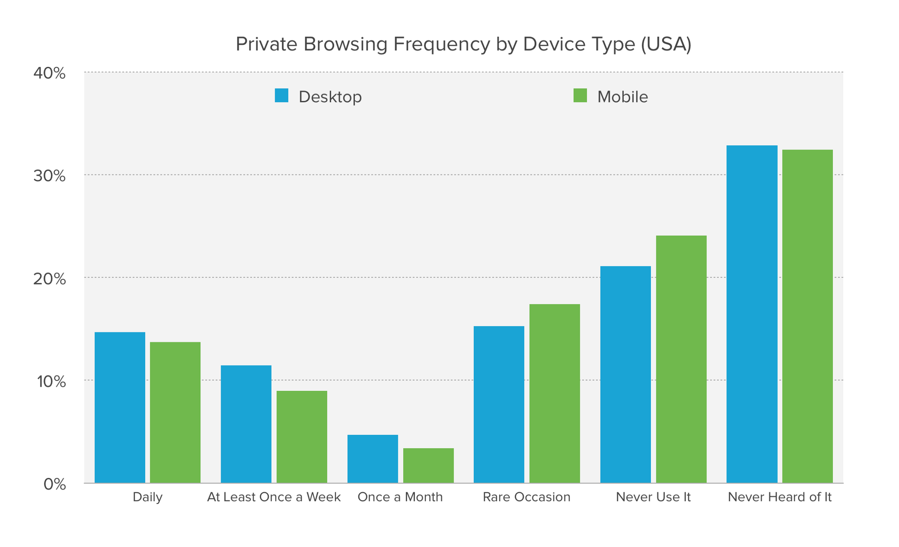
- 人们使用隐私浏览的第一个原因是“令人尴尬的搜索”
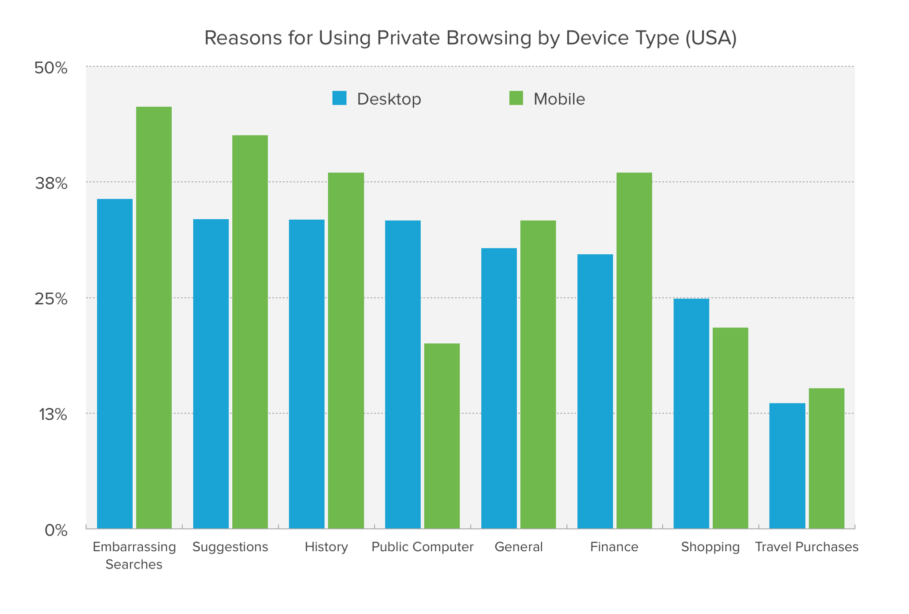
- 65% 的受访者表示，在了解隐私浏览的局限性后（隐私浏览模式只会阻止你的浏览器历史记录被记录在你的计算机上，并不会提供任何额外的保护），他们感到“惊讶”、“误导”、“困惑”或“受到伤害”；
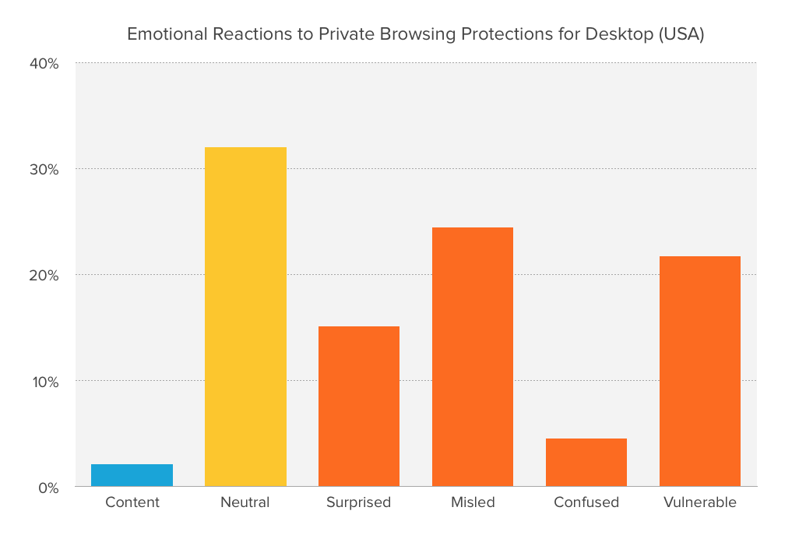

### 从技术视角看隐身模式
#### 1. 用户访问网站的过程
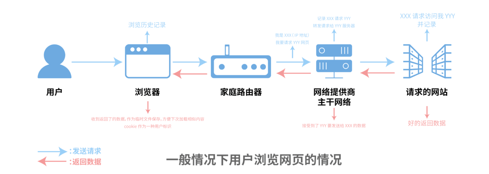
- 打开浏览器，输入网址。这时候浏览器就会默默将此过程保留在历史记录中；
- 连接请求通过用户家中的网线，层层递进，到达互联网供应商的主干网络，再接着连接到用户请求的网站地址，这个时候就网站就能拿到用户的 IP 地址了；
- 网站返回数据给用户，网页大部分的内容作为临时文件被暂存在用户电脑中；
- 用户如果进行注册/登录，则会将用户信息保存/更新在服务器端。将 Cookie 保留在本地作为验证用户的一种方式，避免用户多次反复的登录。当然进行注册时填写的手机号、邮箱、家庭住址也会被浏览器记录，方便用户下次调用。

>   可以看到整个过程一般而言有 3 种数据是保存在用户的电脑上的，那就是浏览记录、临时文件与 Cookie 和表单填写的内容。而有 1 或 2 种的数据被保留在了网站那边，就是 IP 地址和用户填写的注册信息。

> 现在非常多的公司和学校建立了专有的网络环境，对外只显示 1 个 IP，数据返回的时候再发送到相应的内网 IP 上。雇主和学校有心想看的话还是能够知道内网的某个人浏览了什么。对于 HTTP 网站链接，雇主和学校能够完整的了解用户浏览了哪些网站，用户看了哪些内容，停留了多久，针对哪些网站进行了点击跳转等等；对于 HTTPS 网站链接，由于证书的存在和相应的验证机制，一般而言 HTTPS 解密（中间人攻击）很难发动，所以只能够了解到用户浏览了哪些网站而已。

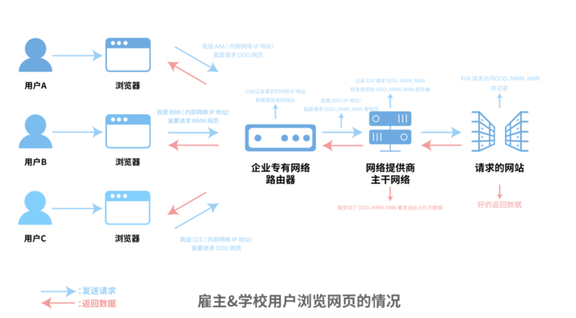

#### 2. 浏览器隐身模式检测的博弈
> 在 Chrome 76 之前，存在一个漏洞，许多网站利用该漏洞来检测用户是否在 Chrome 的隐身模式下访问网站。这些网站只需要尝试使用 FileSystem API 用于存储临时或永久文件的 。此 API 在隐身模式下被禁用，但在非隐身模式下存在，因此产生了差异，该差异被利用来检测用户是否正在使用隐身模式浏览网站并阻止这些用户查看网站的内容。
```
const fs = window.RequestFileSystem || window.webkitRequestFileSystem;
if (!fs) {
  console.log('检测失败');
} else {
  fs(
    window.TEMPORARY,
    100,
    console.log.bind(console, '非无痕模式'),
    console.log.bind(console, '无痕模式')
  );
}
```
>   后来谷歌修复了一个漏洞，不幸的是，他们的修复导致了另外两种方法，仍然可以用来检测访问者何时进行私密浏览。
- 基于文件系统大小检测隐身模式：该方法基于为浏览器使用的内部文件系统预留的存储量。研究发现，Chrome 隐身模式和非隐身模式之间存储配额存在区别，如果临时存储配额<= 120MB，那么可以肯定地说它是一个隐身窗口。这个方法主要通过navigator.storage.estimateAPI 来进行获取和判断。
```
if ('storage' in navigator && 'estimate' in 
navigator.storage) {
  const { usage, quota } = await navigator.storage.estimate();
  if (quota < 120000000) {
    console.log('无痕模式');
  } else {
    console.log('非无痕模式');
  }
} else {
  console.log('检测失败');
}
```
- 通过访问时间检测隐身模式：在读取和写入数据时，内存文件系统总是比磁盘文件系统快。研究发现，在隐身模式下，Chrome 会将写入 API 的数据存储在内存中，而不是像在正常模式下那样将数据持久化到磁盘。根据这些写入的速度，网站理论上可以确定浏览器是否使用隐身模式。
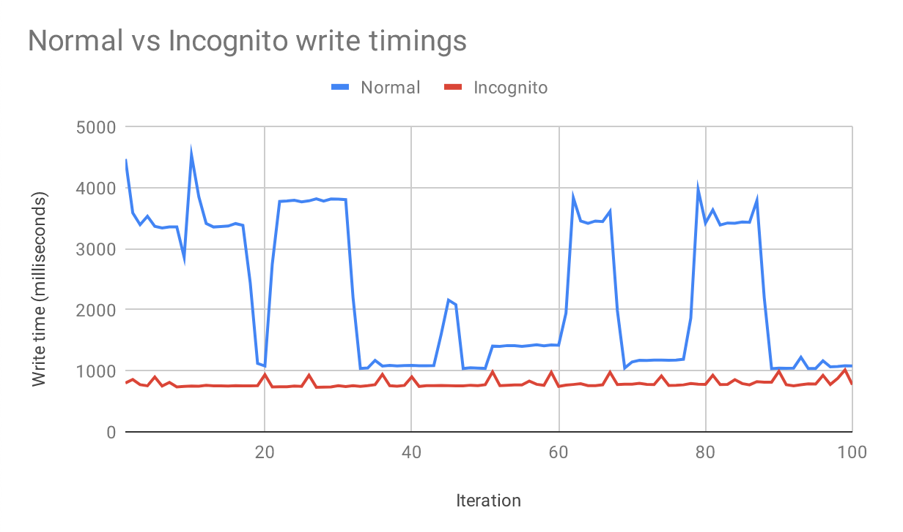

>   Chrome 开发人员看到了这两点：在 2018 年 3 月的设计文档中，他们确定了基于时间和文件系统大小检测隐私模式的风险，并进行了替代实现：只将元数据保存在内存中，并加密磁盘上的文件。这将解决网站使用时间来区分内存和磁盘存储的风险，并消除基于文件系统大小和文件系统类型（临时与持久）的差异。

#### 3. 隐私模式下如何标识用户
- 场景
  - 当产品和数据分析师需要更精准的数据时；
  - 当无需登陆的页面（如社区文章）需要杜绝隐身模式刷 UV 访问量时；
  - 当无需登陆的投票站点需要杜绝隐身模式反复投票点赞时；
  - 当无需登陆的问卷类网站，需要限制用户只能进行一次问卷提交或者第二次打开，需要展示前次提交的结果时；
  - ...

- 设备唯一标识与浏览器指纹
  - 唯一标识（如果说要获取设备唯一标识，也许你会想到类似 IMEI、Android ID、MAC 地址等思路）
    - 【IMEI】从 Android 10 开始，应用必须具有 READ_PRIVILEGED_PHONE_STATE 特许权限才能访问设备的不可重置标识符（包含 IMEI 和序列号）。
    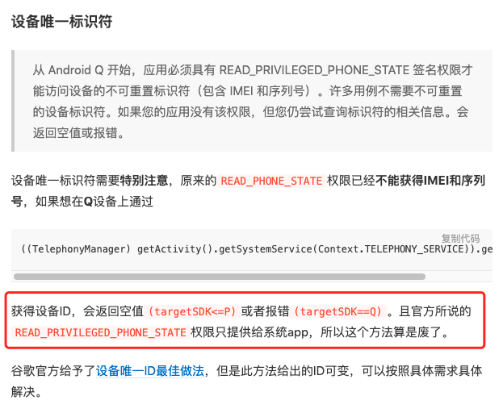
    - 【MAC 地址】默认情况下，在搭载 Android 10 或更高版本的设备上，系统会传输随机分配 MAC 地址。
    - 【Android ID】不具有真正的唯一性，ROOT、刷机、恢复出厂设置、不同签名的应用等都会导致获取的 Android ID 发生改变，并且不同厂商定制的系统的 BUG 会导致不同的设备可能会产生相同的 Android ID。

    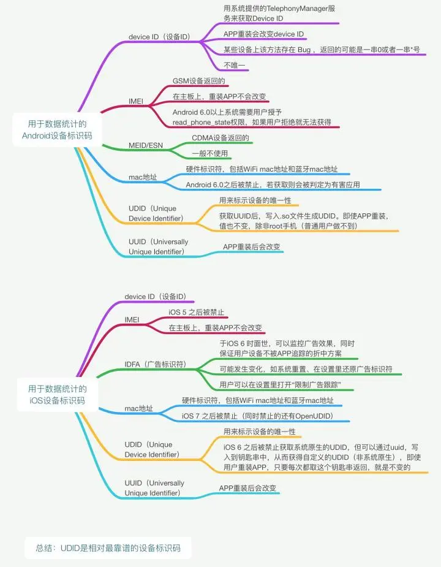
  - 浏览器指纹
    - 【背景】而如果回到我们前端场景下，以上这些方法又多了很多局限性，比如有的需要特许权限，有的需要依赖于原生开发的配合，那么，有没有一种只需要前端参与，也可以获得不错的准确率的唯一标识方案呢？
    - 【认识】指仅通过浏览器的各种信息，如 CPU 核心数、显卡信息、系统字体、屏幕分辨率、浏览器插件等组合成的一个字符串，就能近乎绝对定位一个用户，就算使用浏览器的隐私窗口模式，也无法避免。
      > 这是一个被动的识别方式。也就是说，理论上你访问了某一个网站，那么这个网站就能识别到你，虽然不知道你是谁，但你有一个唯一的指纹，将来无论是广告投放、精准推送、安全防范，还是其他一些关于隐私的事情，都非常方便。
  - 浏览器指纹的技术点与分类
    - 基本指纹：浏览器基本指纹是任何浏览器都具有的特征标识，比如 UserAgent、屏幕分辨率、CPU 核心数、内存大小、浏览器插件及扩展、浏览器设置、语言、硬件类型、操作系统、时区、地理位置、DNS、SSL 证书等众多信息，这些指纹信息“类似”人类的身高、年龄等，有很大的冲突概率，只能作为辅助识别。可以在这个网址进行查看本地浏览器的基本特征。
    - 高级指纹：浏览器高级指纹与基本指纹的区别是：基本指纹就像是人的外貌特征，外貌可以用男女、身高、体重区分，然而这些特征不能对某个人进行唯一性标识，仅使用基本指纹也无法对客户端进行唯一性判定，基于 HTML5 的诸多高级功能就能生成高级指纹了。高级指纹包括 Canvas 指纹、Webgl 指纹、AudioContext 指纹、WebRTC 指纹、字体指纹等；
    - 综合指纹：零散的指纹信息并不能真正的定位到唯一用户，并不能用来代表一个用户的唯一身份（用户指纹）。综合指纹是指将所有的用户浏览器信息组合起来，就可以近乎 99%以上的准确率定位标识用户。将基本指纹和高级指纹组合起来就可以生成综合指纹（用户指纹），这样就可以达到接近 99%以上定位唯一用户了。

  - Nothing Private 的识别原理
    - 抓包
      - 初次访问
        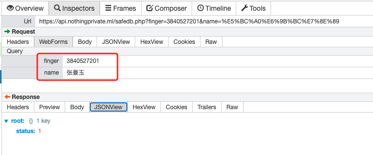
      - 再次访问
        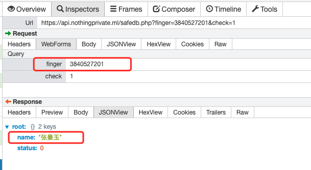
    - 原理
        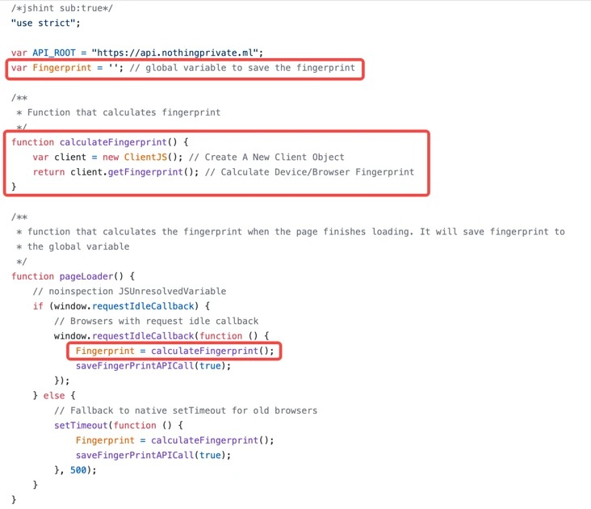

        > Nothing Private 使用 ClientJS（用纯 JavaScript 编写的设备信息和数字指纹）的浏览器指纹识别功能来获取你的 Web 浏览器的指纹，核心方法在于getFingerprint。
        
        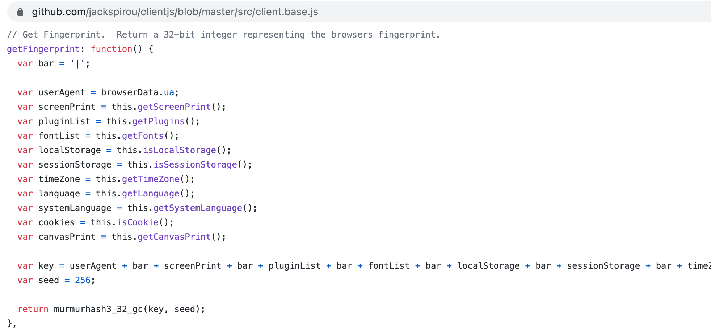
  - FingerprintJS
    > FingerprintJS 是一个快速的浏览器指纹库，纯 JavaScript 实现，没有任何依赖。默认情况下，使用 Murmur Hash 算法返回一个 32 位整数，Hash 函数可以很容易地更换。同时，他也很轻量：开启 gzipped 后只有 843 bytes，匿名识别网络浏览器的准确率高达 94%。
    ```
    import FingerprintJS from '@fingerprintjs/fingerprintjs';
    // 初始化
    const fpPromise = FingerprintJS.load();

    (async () => {
      const fp = await fpPromise;
      // 生成浏览器指纹
      const result = await fp.get();
      // 获取浏览器指纹
      const visitorId = result.visitorId;
      console.log(visitorId);
    })();
    ```
  - 实现 Canvas Fingerprinting
    > 基于 Canvas 绘制特定内容的图片，使用 canvas.toDataURL()方法返回该图片内容的 base64 编码字符串。对于 PNG 文件格式，以块(chunk)划分，最后一块是一段 32 位的 CRC 校验，提取这段 CRC 校验码便可以用于用户的唯一标识。
    ```
    // 把 ASCII 字符串转换为十六进制值
    function bin2hex(s) {
      let n,
        o = '';
      s += '';
      for (let i = 0, l = s.length; i < l; i++) {
        n = s.charCodeAt(i).toString(16);
        o += n.length < 2 ? '0' + n : n;
      }

      return o;
    }

    // 获取指纹UUID
    function getUUID(domain) {
      // 创建 <canvas> 元素
      let canvas = document.createElement('canvas');
      let ctx = canvas.getContext('2d');
      ctx.textBaseline = 'top';
      ctx.font = "14px 'Arial'";
      ctx.fillStyle = '#f60';
      ctx.fillRect(125, 1, 62, 20);
      ctx.fillStyle = '#069';
      ctx.fillText(domain, 2, 15);
      ctx.fillStyle = 'rgba(102, 204, 0, 0.7)';
      
      // 绘制指定的内容
      ctx.fillText(domain, 4, 17);

      // toDataURL返回一个包含图片展示的 data URI
      let b64 = canvas.toDataURL().replace('data:image/png;base64,', '');
      let crc = bin2hex(atob(b64).slice(-16, -12));
      return crc;
    }

    console.log(getUUID('https://www.baidu.com/'));
    ```
    

### 如何更好的保护个人隐私

#### 1. 我们应该在何时使用私密/隐身模式？
- 你想将你的工作和个人生活分开；
- 你可能会共用一台计算机或设备，并且你不希望你的家人、朋友、同事窥探；
- 你可能正在购买礼物，但你不希望任何东西破坏可能的惊喜；
- 或者，也许你只是想限制公司收集有关你的数据量，并且你重视隐私；
- 使用公共场所的电脑设备时。

#### 2. 如何防止被生成“浏览器指纹”？
- 【表层】通过浏览器的扩展插件，阻止网站获取各种信息，或者返回个假的数据，这种方式是在网页加载前就执行一段 JS 代码，更改、重写、HOOK 了 js 的各个函数来实现；
- 【深层】从浏览器底层修改 API 使得这些在 js 层获取的信息并不唯一，不管如何组合都不能生成一个唯一的代表用户的指纹（代表：猫头鹰浏览器）。

#### 3. 如何免受广告跟踪器的监视和跟踪
- 禁用第三方 Cookie
  - 网站无法使用 Cookie 查看您在各个不同网站上的浏览活动，因而无法实现某些功能或目的（例如为您展示个性化广告）。某些网站上的功能可能会无法正常运作。
- 禁用 JavaScript 脚本
  - 不现实、现状不允许
- 使用VPN
  - VPN 服务通过远程服务器路由流量，因此看起来你是从另一个位置或多个位置进行浏览
- Tor 浏览器（洋葱浏览器）
  - 把分散在全球的计算机连起来形成一个加密回路。当你通过 Tor 网络访问互联网时，你的网络数据会通过多台电脑迂回发送，就像洋葱包裹其核心那样掩饰你的网络活动，使得跟踪流量变得困难，你访问的网站真的不知道你在哪里，只知道你的请求路由通过的最后一个服务器的大致位置；信息传输在每一步都被加密，无从得知你所处位置和信息传输目的地


